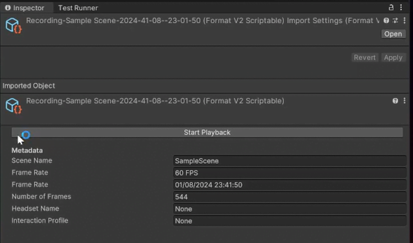

# Getting Started

EventHorizon is a suite of packages for accurately recording and playing back events for Unity VR-Based experiments. It is built with simplicity and ease-of-use in mind.

**Note:** This assumes your project is using the Meta XR integration, and also might be outdated. Open an issue if things don't match up.

## Installing the package

If you have installed the package, feel free to skip this section; Otherwise, do stick around.

**Note:** More detailed and up-to date explanations can be found in the project's [README.md](https://github.com/Shloon/Event-Horizon). 

Let's begin by adding our scoped repository. First, go to the `Package Manager` in `Project Settings`. Next, fill out the details of the scoped repository, which currently are: 
- Name: `ARL EventHorizon`
- URL: `https://registry.npmjs.com`
- Scope(s): `il.runiarl`

You should end up with something like this:

Click on `Save` to add the scoped registery.

Next, open the Package Manager window. If the scoped registries are not already focused, click on the dropdown label menu labeled "Packages:", and select `My Registries`.
You should now see our packages:

Next, select the `Event Horizon - MetaXR integration` package from the list, and click on `Install` in the top-right corner. This should pull and install the correct version of `Event Horizon - Core Package` from the registry as well. Note that if you don't have the `Meta XR Core SDK` installed, it will also be pulled. If you encounter issues with installing the Meta XR SDK, [please refer to their documentation](https://developer.oculus.com/documentation/unity/unity-package-manager/).

## The basics

### Scene Setup

Now that we have `EventHorizon` installed, it's time to start recording. But to get a better grip of the SDK, let's start with recording a simple scene with no VR shenanigans whatsoever. Start by creating a new scene, via `File -> New Scene`. There, choose the `Basic (Built-in)` scene. You should have the following, simple scene:

Next, let's add a plane with position `(0, 0, 0)` and scale `(10, 10, 10)` ,and a very simple cube, at position `(0, 30, 0)`. Add a `rigidbody` to the cube. Feel free to adjust the setting to your liking.

If you followed my instructions to a teeth, here's how your scene should look like:

### Trackables and the TrackableManager

Now let's get to the fun part. In order to record a scene, we need to choose which objects to track. To that end we use `Trackables`, which track various properties of the GameObject they're attached to, or a specific child component of it. However, before we add the `Trackable`s, we need to add a `TrackableManager`. The `TrackableManager` is a runtime component, which `EventHorizon` uses to keep track of all the... you guessed it, `Trackable`s in the scene. The easiest way to add a `TrackableManager` is to right click on the scene hierarchy and choose `EventHorizon -> Trackable Manager` or click `Game Component -> EventHorizon -> Trackable Manager` in the top menu. If you choose to inspect the newly-added element, it should look a little bit like this:

A little sad that there are no trackables, huh? Now, let's add one to the cube. For now, we will use a `TransformTrackable`, which tracks the transform (position, rotation, scale) of every sample point (more on that later). Add it to the cube we created by selecting the cube, going to its inspector, clicking on `Add Component`, and choosing `Event Horizon -> Transform Trackable`, or by typing `Transform Trackable` and selecting it from the search results. You should see the following component popping up:

Each transform has an `ID` field. This is a **unique ID** that is used by the `TrackableManager` to actually track the object while recording, and then playing the recording back during `Inspection Mode` (more about that later). Each trackable starts with a randomly-generated ID. You can regenerate this ID using the button right next to it. 

**Important note:** The ID is the only thing binding your trackable to its data within a recording file. If you change the ID, you won't be able to replay the motion your trackable did. So make sure to not change it after setting the scene up.

### The recorder

Now, let's go back to the `TrackableManager` object we created before. The keen-eyed of you noticed that a little component, called `Recorder`, is also included within it. This contains some settings that we'll use in our recording. It should look like this:

You can change the name of the recording to whatever you like. The defaults save a recording to a special `Recordings` folder within your `Assets` folder, with a file format of `recording-{sceneName}-{timestamp}.evh`. This makes it more accessible within Unity, while helping you not lose any recordings you already have made. You can use these two tokens (`{sceneName}` and `{timestamp}`) to customize this name to your liking.

You can also adjust the sampling rate. While we aim to reduce the overhead of recording to the minimum possible, do not use this 

### Making the scene... Explosive

Now select the cube, and duplicate it... around 24 times. Or more, if you want to. Notice that all the cubes have the same ID, which means we have to give each one its own unique ID (and Unity will let you know about it).

Instead of doing it manually, you can invoke the built-in autofixers by clicking on `Event Horizon -> Fix All Issues` in the top menu. This will assign each of the cubes it's own ID. Note that these autofixers are also triggered when saving files, so simply saving the file will suffice. When an autofixer is being applied, a warning would be added to your log:

### Camera Set, Action, and Playback!

Once we've done that, we're ready to start recording. Simply start playing the scene, wait a couple of seconds, and then stop playing it. If you haven't changed anything in the recording settings, the new recording file should be created under `Assets/Recordings`. Sometimes, if either the recording or the folder does not appear, refresh the asset view using `Ctrl+r` and they should appear.

Go and examine the file. You should see something like this in the inspector:

This includes the metadata of the recording, as well as an option to play it back. Before you do that, we recommend that you open the `Timeline` window (via `Window->Sequencing->Timeline`) and dock it to the Project view, like this:

Next, press `Start Playback` in the recording's inspector. This will begin `Inspection Mode`, a special version of Unity's play mode in which you can inspect the recording and play it back. EventHorizon loads the recording and automatically parses it to a timeline, which would look like this:

You can press play to play back the recording, or move the timeline seekhead. It is recommended to go to `Scene Mode` and inspect the interactions between the different cubes.

When you're done inspecting, stop playing the scene.

**Important note:** The timeline only affects the tracked objects. The rest of the objects play normally.

## Getting more with VR

Now that we covered the basics of EventHorizon, let's actually add a VR rig and track events! Before we do anything, let's fix all the problems related to the Meta XR SDK itself. Go to `Project Settings -> Oculus`, and fix all the issues there.

Now that this is sorted out, let's go back to our scene and add a VR rig. In the vanilla Oculus SDK, this would involve adding either the `OVRCameraRig` or the `OVRPlayerController` prefabs, and manually setting up the controllers. For your convenience, we included a pre-set rig with both hands and controllers, following Meta's official documentation, that can be found under `packages/il.runiarl.eventhorizon.metaxr/Prefabs` under the name `MetaPlayerController`.

Let's clean up the scene, and remove all the cubes. Assuming you added the `MetaPlayerController` prefab to the scene, it should look like this:

Next up would be to start tracking this prefab. To do this, we need to add specialized trackers (hooks) to both controllers, both hands, the camera rig and the player controller objects, and manually set their IDs. To save time, you can use a one-click integration. The easiest way to do so would be to go to `Event Horizon -> Apply One-Click integration` in the main menu, or by right clicking on the `MetaPlayerController` object in the scene, and choosing `Event Horizon -> One-Click Integrations -> Auto-guess` from the menu. The One-Click integrations scans the prefab and adds all the relevant hooks to all its subcomponents.

Note that by default, all the IDs are unassigned:

You need to now manually apply the autofixers from the menu, `Event Horizon -> Fix All Issues`. Saving the scene won't automatically trigger the autofixers. You can also bypass it by adding and deleting an empty game object in the scene, marking it "dirty", and therefore triggering the autofixes.

You are now ready to record. You can now further customize your scene, add other trackables, etc. To record, just connect your headset and start a recording. When you're done recording, you can go to inspection mode as we did before. You can now start the playback, and go to one of the cameras nested in the `MetaPlayerController`.

Sometimes you might come across this black "rectangle" appearing in your scene: 

This is mostly due to the way the Meta XR SDK hooks into the Unity Engine, but it doesn't impact your recording. If you want, you can remove it by going to the `CenterEyeAnchor` and disable the `MeshRenderer` component there.
