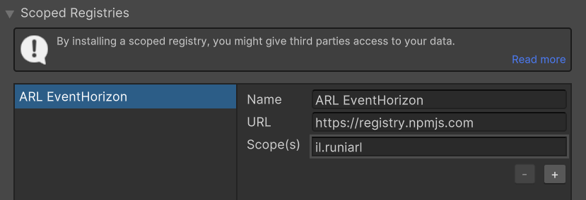
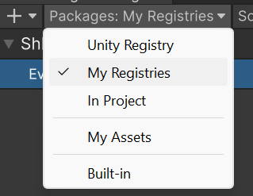

<h1 align="center">
    
    <br>
    Event Horizon
    <br>
</h1>

<p align="center">
    Utilities for recording, reproducing, and visualizing VR experiments in <a href="https://unity.com">Unity</a>. <br/> Full documentation TBD.
</p>

<p align="center">
    
    
    
    
</p>

## Installation

### Via Official Scoped Repositories
**Note**: Event Horizon currently requires the use of preview packages, which may contain untested beta features. Stick to non-preview releases unless advised otherwise or if you know what you're doing.

We currently host all the event horizon packages on NPM with the `il.runiarl` prefix. Here's how to add our scoped registry:
1. Go to the `Package Manager` in `Project Settings`.
2. Add a new scoped registry with the following details:
   - Name: `ARL EventHorizon`
   - URL: `https://registry.npmjs.com`
   - Scope(s): `il.runiarl`
3. Click on `Save`.



Next, open the Package Manager window, click on the dropdown label menu labeled "Packages:", and select `My Registries` to list our packages.



We advise only installing the packages relevant to your development environment. For instance, when working with the Meta XR SDK, opt for the `Event Horizon MetaXR Integration` package; it will automatically handle the dependencies for you.

### Via Git URL
Alternatively, you can add `Packages/manifest.json` with your favorite text editor. For example, to add the core package (`il.runiarl.eventhorizon`), add following line to the dependencies block:

```json
"dependencies": {
  "il.runiarl.eventhorizon": "https://github.com/shloon/Event-Horizon#upm",
  ...
}
```

This method requires manual management of package versions. Check the Event Horizon GitHub repository for the latest compatible releases. For more information, read the Packages section below.

## Getting started

TODO. We currently plan to let users experiment on a MetaXR-Based repository that we'll add in the future.

## Packages
This repository serves as a comprehensive collection of all packages necessary for the Event Horizon suite. Below is an overview of the primary packages and their purposes.

| Package                          | Description                                                                                    | Branch       |
| -------------------------------- | ---------------------------------------------------------------------------------------------- | ------------ |
| `il.runiarl.eventhorizon`        | The foundational package required for any Event Horizon implementation.                        | `upm`        |
| `il.runiarl.eventhorizon.metaxr` | Dedicated package for integration with the Meta XR SDK, enhancing support for MetaXR hardware. | `upm-metaxr` |

Officially released branches are distinctly marked with their version numbers, for instance, `upm-v0.1.0` denotes the version for the `il.runiarl.eventhorizon` package.

The branches specified are consistently updated with the latest changes whenever commits are pushed to the repository. However, in order to access the most recent updates, you need to manually update your packages, as the Unity package manager does not handle this process automatically. Consult [Unity's documentation on Locked Dependencies](https://docs.unity3d.com/Manual/upm-git.html#git-locks) for more information.

it is recommended to stay informed about updates and changes, as we may add, change or deprecate some of the packages listed above.

# Limitations

TODO

# Future Improvements

TODO
